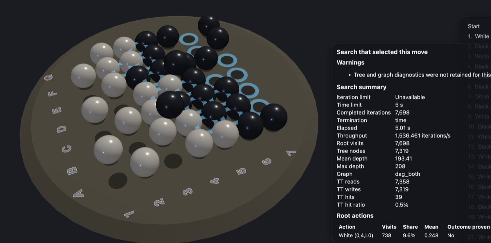

# Monte Carlo Tree Search
[](https://github.com/thomasmarsh/mcts/actions/workflows/rust.yml)

A learning project and testbed for game search. It is one of successive
generations of MCTS engines I have built over the years, and it has grown into
a small workspace: a reasonably efficient core engine, a couple dozen game
implementations, a browser UI to play them, and a tuning layer for finding good
search configurations. It is proof of concept quality in the sense that it is
not a published, stable library, but the engine is strong enough to play well
against other Rust MCTS libraries and the pieces mostly fit together.

The current focus is training stronger agents. The near-term goal is support for
Gumbel AlphaZero style self-play, and along the way the project doubles as a
place to try selection and backup techniques from the literature and see whether
they actually help. Othello is the game I am using for strength work right now,
scored against [Edax](https://github.com/abulmo/edax-reversi) as an external
yardstick.

## Getting started: play some games

You need a Rust toolchain and [pnpm](https://pnpm.io/). On macOS with Homebrew,
building the server and bench crates needs no additional database library setup.

```sh
(cd apps/ui && pnpm install && pnpm build)
cargo build --release
cargo run --release -p server
```

Then open http://127.0.0.1:7878 and pick a game. The server is stateless; it
spawns the per-game binaries (compiled as part of the workspace build) as child
processes and talks to them over JSON-line stdin/stdout pipes.

<p align="center">
  
</p>

For UI work with hot reload, run `pnpm dev` from `apps/ui/` alongside the server
instead of `pnpm build`. It serves the app on http://localhost:5173 with `/api/*`
proxied to the Rust server. Other `ui/` commands: `pnpm typecheck`, `pnpm lint`,
`pnpm test`.

## What is in here

- `crates/mcts/` - the core search engine: bandit algorithms, negamax, and MCTS with a
  pluggable selection, simulation, backup architecture.
- `games/` - game implementations, each its own crate.
- `games/game-core/`, `apps/game-host/` - the shared `Game` support and the subprocess
  protocol (`describe`, `compare validate`, `compare eval`) that the server, the
  bench harness, and the tuner all speak.
- `crates/mcts-tune/` - self-describing search configurations: every strategy axis
  serializes to JSON and reports its own tunable parameters, so the tuner never
  needs to hardcode what it can vary.
- `tools/gdl/` - an early, exploratory GDL-to-Rust compiler pipeline (see below).
- `tools/tuner/` - the tuning layer (see below).
- `apps/server/`, `apps/ui/`, `tools/bench/` - the server, browser UI, and
  operational bench command.
- `research/othello-eval/` - offline learned-evaluation experiments for Othello.
- `examples/*.rs` and per-crate `examples/` - strength comparisons, benchmarks,
  and instrumentation, kept around as reusable tooling.
- `local/` - ignored run output, generated opening books, and working material;
  see [the repository layout](docs/repository-layout.md).

## The core engine (`crates/mcts/`)

The engine has three families of search under one roof.

- **Bandit algorithms**, a small flat multi-armed-bandit family used as a search
  in its own right and as a baseline: uniform random, epsilon-greedy, UCB1, and
  Thompson sampling.
- **Negamax** with alpha-beta and principal-variation search, iterative
  deepening, a time budget, and a transposition table, for the low branching
  factor tactical games. Non-terminal states are scored through an opt-in
  per-game `Evaluator`.
- **MCTS** built from swappable parts on four axes:
  - *Selection*: UCT, RAVE and GRAVE, progressive history, score-bounded MCTS,
    proof-number-guided selection, Bayesian UCT, MENTS and Grill's regularized
    policies, UCB1-Tuned, UCB-V, KL-UCB, GPN bias, and quasi-best-first.
  - *Simulation*: uniform rollouts, MAST, NST, last-good-reply, decisive and
    anti-decisive moves, epsilon-greedy, and evaluator-cutoff rollouts.
  - *Backup*: classic averaging, minimax backup, power-mean and softmax backups,
    TD-style value backup, and Bayesian backup, with MCTS-Solver proof handling.
  - *Final move*: max-average, robust child, secure child, and their variants.

Key features:

- One `Game` trait covers perfect information and imperfect information games;
  ISMCTS and PIMC are supported for the hidden-information ones.
- Transposition tables with configurable keying, and a graph search mode (MCGS)
  with the sibling-update correction.
- Root and tree parallelism, plus tree reuse across moves.
- Symmetry groups per game, so equivalent positions collapse during search.
- Zobrist hashing built from the game's symmetry description.
- Arena-allocated trees (just a `Vec`, in the spirit of
  [indextree](https://github.com/saschagrunert/indextree)).
- Optional evaluators, so a game can supply a heuristic value function instead of
  relying only on rollouts.
- Search configurations that round-trip through JSON, which is what makes tuning
  and the UI's strategy pickers possible.

## Games (`games/`)

Each game is its own crate implementing `mcts::game::Game`, with a bitboard
state, a symmetry group, hashing, tests, and often an evaluator. The
[`new-game`](.claude/skills) helper captures the decisions that recur.

Currently implemented: akron, atarigo, bid tic-tac-toe, breakthrough, congo,
connect4, druid, focus, gonnect, generated hex variants, ingenious, knightthrough,
margo, nim, oh hell, othello, phantom (dark) chess pieces, strata, tak, tanbo,
traffic lights, and tic-tac-toe (hand-written and generated).

## Game description compiler (`tools/gdl/`)

`gdl/` is preliminary investigation, not a core part of the project yet. The idea
is a compiler pipeline that takes a game description and emits an optimized Rust
bitboard implementation of the same shape as the hand-written crates in `games/`,
with GPU kernels as a longer-term target. The current frontend parses a small
typed s-expression rendering of the intermediate representation rather than a
full authoring language, and a first backend lowers rectangular-board programs
into a standalone `Game` crate. Tic-tac-toe is proven end to end this way and its
generated crate, `games/ttt-gen/`, is checked in and cross-checked against the
hand-written `games/ttt/`.

[Ludii](https://ludii.games/)'s `.lud` corpus is used as spec and oracle
material. See `tools/gdl/README.md` and `tools/gdl/DESIGN.md` for the reasoning and the
current status.

## Tuning (`tools/tuner/`)

The tuning layer is inspired by [irace](https://mlopez-ibanez.github.io/irace/):
freeze an explicit deployment objective, then run repeated cohorts of candidate
configurations against held opponents, retaining elites between cohorts and
giving the survivors held-out validation at the end. Under the hood it drives
[SMAC3](https://automl.github.io/SMAC3/) for the model-guided proposals, mixed
with a bootstrap schedule and a random reserve. Runs are foreground and
reproducible from their evidence log. See `tools/tuner/README.md` for the full command
surface.

There is also a Haskell domain model in `tools/tuner/domain-model/`: types and function
signatures only, no implementation. It exists to pin down the concepts -
candidates, objectives, evidence, comparison rules - before they are expressed in
Python and Rust. It has its own
[tutorial](tools/tuner/domain-model/TUTORIAL.md) and reference README. Working through
category-theory framing is a thinking tool for me here.

## Related work

Some approaches and a bit of early code come from
[minimax-rs](https://github.com/edre/minimax-rs), which has an MCTS strategy.
Other Rust MCTS projects worth a look:

- [minimax-rs](https://github.com/edre/minimax-rs): lock-free tree-parallel, good
  for low branching factor tactical games via full expansion and MCTS-Solver.
- [ggpf](https://github.com/TheLortex/rust-mcts): AlphaZero and MuZero with
  TensorFlow, plus RAVE and PUCT.
- [zxqfl/mcts](https://github.com/zxqfl/mcts): clean code, lots of atomics,
  transposition support, good ideas on mixing strategies. From the author of
  TabNine.
- [recon_mcts](https://github.com/trtsl/recon_mcts): focused on parallelism and
  combining tree results.
- [arbor](https://github.com/prestonmlangford/arbor/): single-threaded
  efficiency with a hand-maintained arena.
- [OxyMcts](https://github.com/Sagebati/OxyMcts): a vanilla UCT client.

## AI disclosure

Coding here is agent-assisted, primarily with Claude Sonnet. The core engine,
most of the game implementations, and the original SMAC3 integration predate any
LLM use. The design decisions and any mistakes are mine.

## License

MIT. See [LICENSE](LICENSE). PRs are welcome, though I have not decided whether
this becomes a published library.
