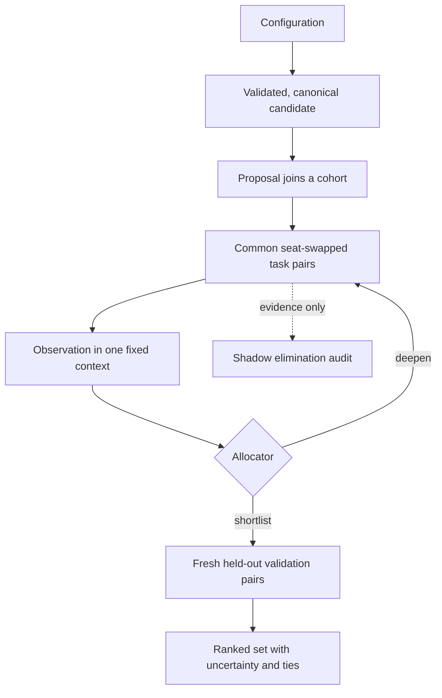

# tuner-domain-model: a tutorial

This is a walk through the model for someone who can read a Haskell `data`
declaration, but has not met this tuner before. We will follow a candidate from
a set of knobs to a published result. Along the way, the types give names to
the mistakes the tuner must not make.

This package is proof-of-concept quality. It is a domain model, not a runnable
tuner: most function bodies are `undefined` on purpose. The Python tuner does
the work. The Haskell types are notes made precise enough that `cabal build`
can catch a vocabulary mismatch.

> _Side note_
>
> A type model cannot prove that a future implementation makes the right
> decision. It can make the decision's inputs, outputs, and forbidden mixes
> hard to ignore. That seems useful before we make the machinery faster.

## The question we are trying to answer

A search-based game player usually has many settings: an exploration constant,
a search budget, a widening rule, perhaps a choice of heuristic. Some settings
exist only when another setting enables them. Some combinations are forbidden.
Some configurations which look different mean exactly the same thing.

We want to spend a finite amount of compute finding configurations that play
well in the setting we care about. That last clause matters. "Wins the most"
is incomplete until we say against which opponents, from which positions, under
which rules, and with how much search effort.

The desired result is therefore not a winning configuration. It is a ranked
set of configurations, each with an estimate, uncertainty, and the evidence
that led to it.

Several ordinary shortcuts fail here:

- One game is noisy, and the first player may have an advantage.
- A candidate can look good against a weak or unrepresentative opponent.
- A cheap evaluation can disagree with a production-quality one.
- A beats B and B beats C need not imply A beats C.
- An eager elimination can discard the candidate we wanted to find.

The rest of the model is a response to these problems rather than an attempt to
make a generic tournament framework.

## A small running example

We will tune a made-up Tak player. Its configuration has a `family`, an
`exploration` value, and an `iteration_budget` that is active only for one
family. We will call three canonical configurations A, B, and C.

Our frozen objective uses two opponents: `weak-baseline` with weight one and
`strong-baseline` with weight two. One tuning block therefore has three cases:
weak, strong, strong. The second block adds another copy of those three cases.
This is deliberately tiny. A real run needs more evidence.

Here is the whole path before we inspect its parts:



## First, make a candidate

A configuration is an assignment of values, such as:

```text
{ family: mcts, exploration: 0.7, iteration_budget: 200 }
```

Before it is a candidate, the configuration is checked against activation,
forbidden-combination, and relational constraints. Then it is canonicalized:
irrelevant inactive values disappear and equivalent forms become one form.
Finally it receives a stable identifier and fingerprint.

```haskell
data Candidate = Candidate
  { candId              :: String
  , candFingerprint     :: String
  , candCanonicalConfig :: CanonicalConfig
  }
```

This gives us a useful promise: A is always A. Playing A with another seed,
against another opponent, or at another allowed measurement setting adds
evidence to A. It does not quietly create another trial with a nearly identical
name.

> _Why remove inactive values?_
>
> If widening is disabled, a width value cannot affect play. Keeping it in an
> identity would let us spend evidence separately on configurations that are
> operationally the same. Canonicalization is a modest piece of bookkeeping
> with a large effect on whether evidence joins correctly.

## Measure a pair, not a game

The smallest unit of evidence is a seat-swapped pair. It is two games of the
same case: same opponent, starting position, and seed. The candidate plays
first once and second once.

```haskell
data PairResult = PairResult
  { prTask  :: PairTask
  , prGames :: (GameResult, GameResult)
  }
```

We score a win as 1, a draw as 0.5, and a loss as 0. The pair utility is the
average of its two games. Swapping seats does not erase all randomness, but it
keeps a first-player advantage from becoming candidate strength by accident.

Nothing decides anything between the two games in a pair. A blowout in the
first game is not a reason to skip the second. The pair is the evidence atom.

For example, if A wins both games against `weak-baseline`, its utility for that
case is 1.0. If it wins one and loses one against `strong-baseline`, that case
contributes 0.5. We keep the game records as well as their summary, so the
average does not throw away the underlying result.

## Give every racer the same course

A task case names one concrete paired comparison. A task corpus is an ordered,
fingerprinted collection of cases. A task prefix is the first N cases of that
corpus.

The central racing rule is short:

> Within a race, every active candidate completes the same tasks in the same
> order before we compare them.

If A plays only `weak-baseline` and B plays only `strong-baseline`, their
scores do not answer the same question. A common prefix gives us a fairer
question: how did these candidates do on precisely these cases? Prefixes are
nested, so the second block includes the first block's evidence and then adds
more.

The task order is stratified and weighted-fair. In our example, each three-case
block is `weak, strong, strong`, matching the objective's weights. A, B, and C
all run that same sequence before the race reacts to the scores.

## Freeze what "good" means

An opponent panel is a frozen, weighted collection of external players. It is a
practical representation of the broader deployment distribution: the mix of
game settings, openings, opponents, seeds, rules, and adjudication that we
actually mean by successful play.

An objective epoch is the name for one frozen reference frame. If the panel or
the objective changes, we start a new epoch. We do not compare an old score
against a new score as though nothing had changed.

Search effort belongs in that reference frame too. A candidate measured at 16
iterations per move and one measured at 64 iterations per move may both be A,
but those are different observations of A.

```haskell
data ObservationContext = ObservationContext
  { ocObjectiveEpochId :: String
  , ocPhase            :: Phase
  , ocTaskPrefix       :: TaskPrefix
  , ocSearchEffort     :: SearchEffort
  }
```

An observation collects the pair utilities for one candidate in one context,
then attaches an estimate with conservative bounds. Two observations are
comparable only when their epoch, phase, prefix, and effort agree.

```haskell
comparable :: Observation -> Observation -> Either String ()
```

That is not a claim that Haskell can prove from these string fields alone. It is
an explicit gate in the model, where a silent comparison would otherwise be
easy to write. If the contexts differ, the comparison must fail visibly.

> _A useful distinction_
>
> Tuning and validation are deliberately different phases. Tuning evidence
> helps us decide where to spend compute. Validation evidence supports the
> result we publish. Reusing the former as the latter would make the search look
> more certain than it is.

## Run a race

A cohort is a group of candidates racing on common prefixes. A typical cycle is
as follows:

1. Admit a mixture of new proposals and retained elites.
2. Complete the next shared block.
3. Turn the completed pairs into comparable observations.
4. Eliminate only where the evidence supports it, or deepen the remaining
   candidates to the next shared block.
5. Keep suitable survivors as elites, admit new challengers, and repeat.

There is no rule that the bottom half must go. A geometric schedule can suggest
where to look, but it is not a discard quota. If A and B are too close to call,
we should say so and collect more evidence. In our example C may be clearly
behind after the first block, while A and B continue to the second.

An elite's already-completed identical pair can be reused. An elite still has
to play every fresh common task faced by its challengers. Reuse prevents paying
twice for the same evidence; it does not give incumbents an easier course.

## Let one allocator spend the budget

The allocator is the only component allowed to choose the next use of compute.
It can introduce a proposal, execute a pair, record an observation, deepen a
cohort, ask for a diagnostic matchup, move to validation, or finish the run.

```haskell
decideAllocation :: Manifest -> ReplayState -> AllocationDecision
readyPairs       :: Manifest -> ReplayState -> Maybe Int -> [PairTask]
```

This avoids several policies each spending from the same budget according to
their own local idea of urgency. The ledger records actual work, including pair
attempts, completed pairs, search iterations, and wall time. The allocator's
decision becomes a concrete resource allocation for the evidence log.

The four large choices are introduce, deepen, diagnose, and validate. Thinking
of them together makes the tradeoff visible: another fresh candidate is compute
we do not spend distinguishing two current leaders.

## Propose without forgetting the unknowns

A proposer suggests configurations worth measuring next. The intended proposer
is a global surrogate model. It uses compatible observations to predict
production-quality performance and uncertainty, while knowing that effort and
task context change what an observation means.

It may exploit a promising region, explore an uncertain one, or use a
random/low-discrepancy reserve. The reserve is important because a model which
never looks outside its early hunches cannot discover that it is wrong.

Each proposal records its source and the observation frontier available when it
was made. This means we can later ask what the proposer knew, rather than
reconstructing a flattering story from the final result. Families receive no
quota or protected budget. A family can be excluded by a frozen policy, but
otherwise it is an ordinary categorical parameter.

## Treat pruning as a hypothesis

Early elimination saves compute only if it is reliable. The model separates
three stages rather than assuming a plausible policy is good enough.

1. A shadow policy records what it would eliminate, but lets every candidate
   continue to the maximum tuning prefix.
2. The completed evidence labels those shadow decisions: did the policy remove
   an eventual leader, reverse a boundary, or behave differently by stratum?
3. A policy that passes a preregistered gate may enforce elimination. A
   predeclared random sample of those eliminations continues anyway as an audit.
   A boundary reversal can suspend active elimination.

The default posture is cautious: shadow decisions are evidence about a proposed
shortcut, not permission to use it. A typed decision margin accompanies an
enforced elimination so that the reason is inspectable.

## Keep rock-paper-scissors visible

The deployment score is useful, but it cannot tell the whole story when play is
non-transitive. The model keeps an opponent-response view and a separate graph
of direct candidate-versus-candidate diagnostics.

The response view can show a reversal: A does better against `weak-baseline`,
while B does better against `strong-baseline`. It cannot prove a candidate
cycle. For that, we need direct pair evidence such as A beats B, B beats C, and
C beats A. Diagnostic pairs have their own budget and do not contaminate the
objective observations or deployment score.

## Validate, rank, and leave a trail

At the end of tuning, the model selects a broad enough shortlist to survive
tuning noise. It measures those finalists on a fresh validation corpus at
production effort. Only this held-out evidence produces the ranked set.

Each ranked entry carries the candidate, its score estimate, a top-k
probability, evidence counts, and any practical ties. We do not invent a strict
order when the measurements support a tie.

Two artifacts let us inspect the result later:

- The manifest freezes the game specification, objective, task corpora,
  policies, effort, and compute budget.
- The append-only evidence log records what happened: proposals, pair outcomes,
  observations, allocations, shadow decisions, interruptions, and completion.

Together, these are stronger than "we got this number." They tell us what was
measured, which decisions were made, and which frozen rules made them.

The `Target` boundary is deliberately narrow. It describes the game executable
as something the tuner can ask to describe, validate, evaluate, or cancel. The
model does not pretend that process management and game execution are pure
bookkeeping.

## Explore the types

```sh
cabal build
cabal repl
```

Then try:

```haskell
:module + MyLib
:info ObservationContext
:t comparable
:t decideAllocation
:t readyPairs
```

`undefined` functions will throw if called. That is expected. Use this package
to inspect the contracts, then follow the corresponding concepts into
`../src/tuner_cli/` to see behavior.

## Where this leaves us

The model does not assert that its race policy is optimal. I do not think a type
signature can settle that. It does make the costly assumptions explicit: what
counts as the same measurement, what evidence permits a comparison, and how an
early pruning decision can be checked after the fact.

That is the point of this package. Before trusting a tuner to make a ranking,
we should be able to say what it measured and why the comparison was allowed.
